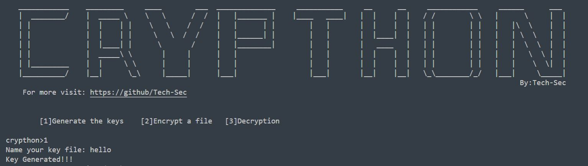
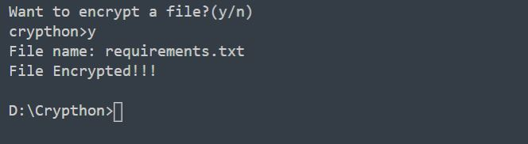
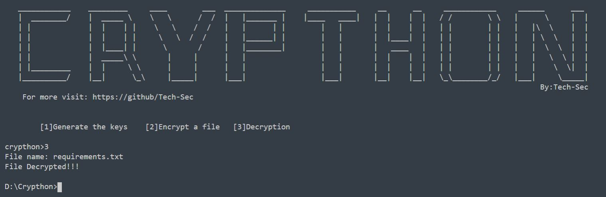

**Crypthon is used for encryption or decryption of files.**

How to use: \
 To getting started type: \
 **python crypthon.py**

**Encryption**

First we have to generate our *key* \
 Choose option '1': \
 

Then it will ask you if you want to encrypt it or not \
 Enter y for yes and n for no \
 Here, we will say yes and enter our requirements.txt as the file to be
encrypted \
 

\
 The file will get encrypted

**Decryption**

for decryption run: \
**python crypthon.py** \
 and choose option '3' \
 Then enter your filename \
 

\
 The file wil get decrypted. \
 If any problems persists, just pull up an issue or DM me on [Instagram](https://www.instagram.com/_imad._.1/). 

